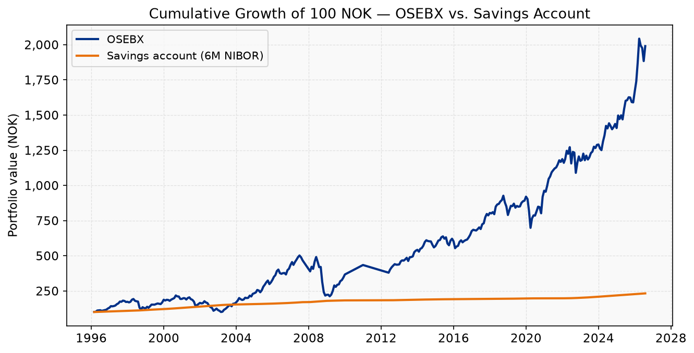
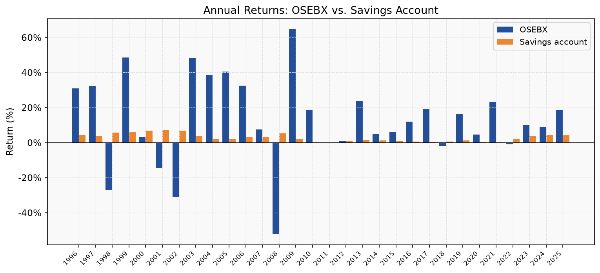
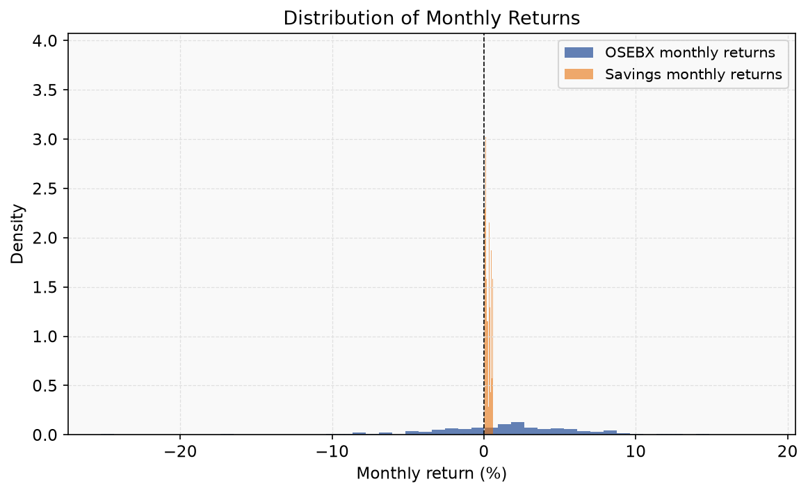
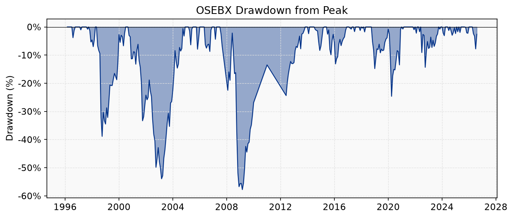
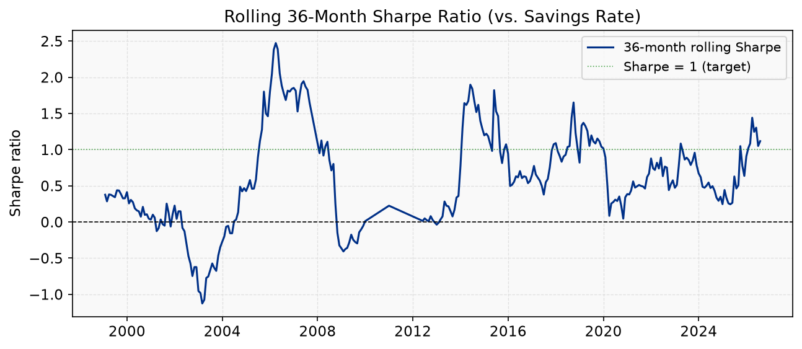
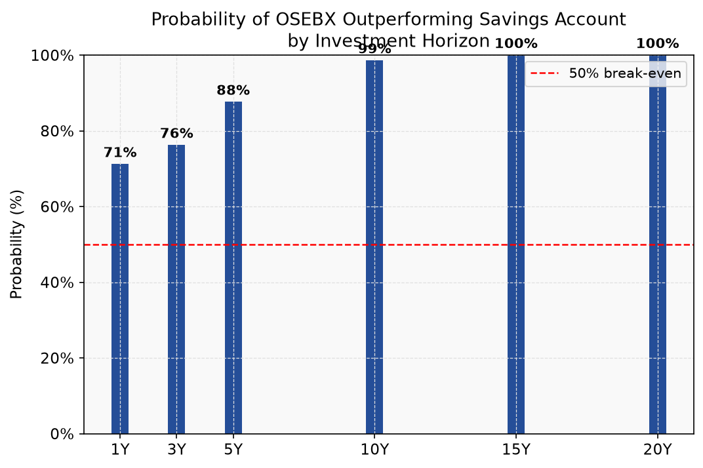
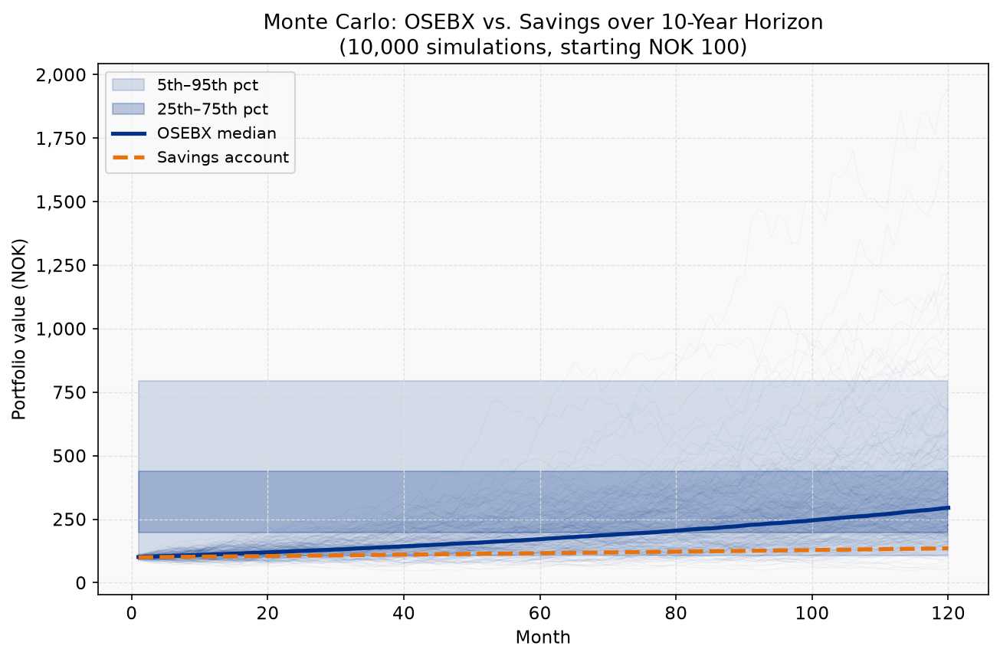

# OSEBX vs. Norwegian Savings Account — A Risk Analysis

**Period:** January 1996 – July 2026  
**Data source:** LSEG Workspace (Oslo Børs index `.OSEBX`; Norwegian 6-month T-bill `NO6MT=RR`)  
**Analysis:** `scripts/analyze_osebx_vs_savings.py`

---

## Executive Summary

Over the 30-year period studied, the Oslo Børs Benchmark Index (OSEBX) delivered a compound annual growth rate (CAGR) of **11.3%**, versus **3.1%** for a Norwegian savings account proxied by the 6-month government T-bill yield. An initial investment of NOK 100 in 1996 grew to approximately **NOK 1,990** in the OSEBX versus only **NOK 233** in the savings account.

This outperformance comes at a significant price: the OSEBX lost nearly **58%** of its peak value during the 2008–2009 financial crisis and took **six years** to recover. An investor who required the money during that period faced devastating losses that a savings account would have entirely avoided.

**The central thesis is not whether OSEBX beats savings — it does, and by a large margin over time — but under what conditions and for what investor profile equity investing makes sense.** The data show that the longer the holding period, the more reliably OSEBX outperforms: over any rolling 10-year window in this dataset, OSEBX beat the savings account 98.6% of the time. Over 15+ year windows, it was 100%.

---

## 1. Introduction & Context

Norwegian households face a seemingly simple choice: deposit money in a savings account and earn the current risk-free rate (~4.5% in 2024), or invest in the Oslo Stock Exchange and accept market risk in exchange for higher expected returns.

This question is especially relevant in the current rate environment. After a decade of near-zero interest rates (2009–2021), Norwegian savings rates are back at multi-year highs, making the comparison more competitive than it was during the post-financial-crisis era. At the same time, Norwegian equities (proxied by OSEBX) have historically delivered strong real returns, benefiting from Norway's oil-linked economy, strong institutional framework, and globally diversified listed companies.

This report uses 30 years of market data to quantify:

- The return premium of equities over savings
- The risk cost required to earn that premium
- The minimum holding period to make equity investing statistically sound
- The probability of loss and magnitude of potential drawdowns

---

## 2. Data and Methodology

### Data Sources (LSEG Workspace API)

| Series | RIC | Frequency | Coverage |
|--------|-----|-----------|----------|
| Oslo Børs Benchmark Index (OSEBX) | `.OSEBX` | Monthly | Jan 1996 – Jul 2026 |
| Norwegian 6-month T-bill yield | `NO6MT=RR` | Monthly | Jan 1996 – Jul 2026 |

**OSEBX** is Norway's main equity benchmark, comprising the 60–70 largest and most liquid companies on Oslo Stock Exchange. It is a price index (dividends not reinvested). Using a price index rather than a total return index slightly *understates* the true long-run equity return, meaning this analysis is conservative with respect to equities.

**Savings rate proxy:** The Norwegian 6-month government T-bill mid-yield is used as the savings rate. This is a reasonable proxy for what a competitive Norwegian savings account (høyrentekonto) pays — typically within 0.5–1.0 percentage points of the Norges Bank policy rate. During the dataset, the 6-month T-bill averaged **3.1%** per year, which tracks the Norges Bank policy rate closely.

### Methodology Notes

- All returns are monthly and expressed in NOK without currency conversion.
- Savings account returns are compounded monthly from the annual T-bill yield: `(1 + r_annual)^(1/12) - 1`.
- Risk metrics operate on the monthly return series as required by the project conventions.
- No transaction costs, taxes (skatt), or fund management fees are included. In practice, equity investing incurs trading costs and potentially an annual management fee (~0.15–0.5% for Norwegian index funds), which would reduce the OSEBX advantage modestly.
- Sharpe ratio is computed with the savings rate as the risk-free benchmark.

---

## 3. Historical Performance (1996–2026)

### 3.1 Summary Statistics

| Metric | OSEBX | Savings Account |
|--------|-------|-----------------|
| **CAGR** | **11.3%** | 3.1% |
| **Total return (1996–2026)** | **+1,890%** | +133% |
| Annualised volatility | 19.4% | 0.6% |
| Maximum drawdown | **−57.8%** | 0.0% |
| VaR 95% (monthly) | −8.1% | ~0% |
| CVaR 95% (monthly) | −13.9% | ~0% |
| Sharpe ratio (vs. savings) | 0.50 | — |
| Annual win rate (OSEBX > savings) | 70% | — |

### 3.2 The Return Premium is Substantial

At 11.3% CAGR versus 3.1%, OSEBX delivered an **annual excess return of roughly 8.2 percentage points** over the savings account. Due to compounding, the cumulative effect over 30 years is staggering: a 14× difference in ending value.

Even after accounting for the fact that the OSEBX is a price index (dividends excluded), this premium is significant. Norwegian listed companies have historically paid meaningful dividends (typically 3–5% yield), meaning the true total return index would have outperformed the savings account by an even wider margin.

### 3.3 The Savings Account was Never the Better Long-Run Asset

The bar chart above shows that OSEBX delivered outsized returns in strong years (e.g., 1997: +56%, 2005: +40%, 2009: +65% recovery) that dwarf anything a savings account can provide. In 7 out of 30 years, OSEBX did deliver *negative* returns — sometimes catastrophically so — while the savings account always delivered positive nominal returns.

---

## 4. Risk Analysis

### 4.1 Volatility — The Fundamental Asymmetry

The savings account's annualised volatility of **0.6%** reflects nothing more than the slight variability in the overnight lending rate. For practical purposes, savings account balances do not shrink in any month.

OSEBX volatility of **19.4% annualised** means that in a typical year, you should expect the index to move by roughly ±19% from its expected return. This is not a tail risk — it is the *normal* operating range.

At the monthly level, the 95th-percentile loss for OSEBX is **8.1%** — meaning that in roughly one month out of every 20, you can expect to lose more than 8% of your investment in a single month. The 99th-percentile monthly loss is **16.8%**.

### 4.2 Value at Risk and Expected Shortfall

| Metric | OSEBX | Savings |
|--------|-------|---------|
| **VaR 95% (monthly)** | **−8.1%** | ~0% |
| **VaR 99% (monthly)** | **−16.8%** | ~0% |
| **CVaR/ES 95% (monthly)** | **−13.9%** | ~0% |

The **Conditional Value at Risk (CVaR)**, also called Expected Shortfall, is particularly important: when you are in the worst 5% of months for OSEBX, the average loss is **13.9%**. These tail events are not hypothetical — they occurred during the 2008 crisis (−22% in October 2008 alone) and the 2020 COVID crash.

For a savings account holder, these numbers are effectively zero. The savings account's VaR is driven purely by interest rate changes, not capital losses.

### 4.3 Return Distribution — Fat Tails and Negative Skew

The return distribution for OSEBX exhibits:
- **Skewness: −1.01** (negatively skewed — large negative events are more common than a normal distribution would predict)
- **Excess kurtosis: +3.82** (fat tails — extreme events occur far more often than a Gaussian model would suggest)

This is a critical insight for risk management: the normal distribution **underestimates** the probability of severe losses. Standard portfolio models based on the bell curve are inadequate for OSEBX. Historical simulation or Monte Carlo methods (used in this report) provide more accurate risk estimates.

The savings account return distribution is effectively a spike — near-zero variance.

---

## 5. Drawdown Analysis

### 5.1 Major Drawdown Episodes

The OSEBX has experienced four major drawdowns (>15% from peak) in the studied period:

| Episode | Peak | Trough | Drawdown | Recovery | Duration |
|---------|------|--------|----------|----------|----------|
| **Global Financial Crisis** | Aug 2007 | Feb 2009 | **−57.8%** | Oct 2013 | **6.2 years** |
| **Dot-com / 9-11** | Jul 2001 | Feb 2003 | **−53.9%** | Nov 2004 | 3.3 years |
| **Russia / LTCM crisis** | Jul 1998 | Sep 1998 | −38.9% | Jun 2000 | 1.9 years |
| **COVID-19** | Feb 2020 | Mar 2020 | −24.6% | Dec 2020 | 10 months |

The Calmar ratio (CAGR / |max drawdown|) for OSEBX is **0.20**, meaning you earn about 0.20% of annual return per 1% of maximum drawdown — relatively low, indicating that the drawdowns are deep relative to the long-run return.

### 5.2 The Emotional and Financial Reality of Drawdowns

The 2008–2009 crisis drawdown of −57.8% deserves special attention. This means an investor who had NOK 1,000,000 in OSEBX at the August 2007 peak watched their portfolio fall to approximately **NOK 422,000** — a loss of nearly NOK 578,000. The portfolio did not recover its peak value until October 2013, more than **six years later**.

During this same period, a savings account would have grown modestly positive (rates were 4–6% in 2007–2008 before being cut to 1.25% in 2009). An investor in savings would have both preserved their capital *and* collected interest.

The savings account provides what economists call a **"certainty equivalent"** — zero nominal downside risk. For an investor with a mortgage payment, a tuition bill, or a near-term retirement date, this certainty has real economic value that raw return numbers do not capture.

---

## 6. Risk-Adjusted Returns

### 6.1 The Sharpe Ratio in Context

With a Sharpe ratio of **0.50** (using the savings rate as risk-free benchmark), OSEBX delivers positive risk-adjusted excess returns but not spectacularly high ones. A Sharpe of 0.50 is considered moderate — respectable for a single-country equity index.

The rolling Sharpe chart reveals that this average masks enormous temporal variation:

- **1996–2000 (tech bubble):** Sharpe ratio climbing well above 1.0 as OSEBX surged
- **2001–2003 (bust):** Sharpe deeply negative; savings was clearly dominant
- **2004–2007 (recovery/boom):** Sharpe above 1.0 again
- **2008–2010 (GFC):** Sharpe crashed to below −2.0
- **2010–2020 (ZIRP era):** Positive and rising — *but savings rates were near zero, so the comparison was very easy for equities*
- **2022–2023 (rate hikes):** Sharpe declined as rising interest rates made savings more competitive

The current environment (2024–2026) with savings rates near 4.5% represents a genuinely more competitive landscape for savings accounts than the 2010–2021 decade.

### 6.2 Practical Risk-Adjusted Summary

| Metric | Interpretation |
|--------|----------------|
| Sharpe 0.50 | Every unit of risk taken produces 0.50 units of excess return |
| Calmar 0.20 | Modest reward for the drawdown risk accepted |
| Sortino (est.) | Negative-return volatility is high — equity losses are asymmetric |
| VaR 95% = −8.1%/month | One in 20 months, you lose more than 8% |

For a savings account holder, all of the above risk metrics are near zero. The comparison is therefore fundamentally one of **certainty vs. expected value**.

---

## 7. Probability of Outperformance by Holding Period

This is perhaps the most practically important finding for investors. Looking at every rolling window of a given length within the 1996–2026 period:

| Holding Period | P(OSEBX beats savings) |
|---------------|------------------------|
| 1 year | 71.2% |
| 3 years | 76.3% |
| 5 years | 87.6% |
| 10 years | **98.6%** |
| 15 years | **100%** |
| 20 years | **100%** |

### Interpretation

Over a **single year**, OSEBX fails to beat savings in roughly **1 in 3 rolling 12-month windows**. This is a material risk if your investment horizon is short.

Over **5 years**, the probability of outperformance rises to 87.6% — still leaving ~1 in 8 five-year periods where savings won.

Over **10+ years**, the historical data show near-universal OSEBX outperformance. No 15-year period in this dataset produced a savings account winner.

**The holding period is the single most important variable in the equity vs. savings decision.**

This finding is consistent with the equity risk premium literature: the extra return from equities compensates for the risk of temporary large losses, and that compensation only fully materialises over long horizons when mean reversion has time to work.

---

## 8. Monte Carlo Simulation — 10-Year Horizon

To simulate future outcomes with uncertainty, a 10,000-path Monte Carlo simulation was run using OSEBX's historical monthly return distribution (mean: 0.89%/month, σ: 5.5%/month) and the current average savings rate.

### Results for a 10-Year Horizon (starting NOK 100)

| Percentile | OSEBX Outcome | Savings Outcome |
|-----------|--------------|-----------------|
| 5th (bear case) | NOK 108 | NOK 135 |
| 25th | NOK 198 | NOK 135 |
| **Median** | **NOK 295** | **NOK 135** |
| 75th | NOK 440 | NOK 135 |
| 95th (bull case) | NOK 794 | NOK 135 |

**P(OSEBX beats savings in 10 years) = 90.3%**

### The Downside Scenario

The 5th percentile OSEBX outcome (NOK 108) is **below the guaranteed savings outcome (NOK 135)**. An investor in the unlucky 5th percentile would have done better in a savings account — and this scenario is not unrealistic; it approximates what happened to investors who started in 2001 (dot-com peak) and exited in 2011.

This is the **core risk**: equity investing has a ~10% chance over 10 years of underperforming a savings account, and in the absolute worst scenarios, investors could lose a significant portion of their principal.

### The Upside Case

Conversely, the **median OSEBX outcome (NOK 295) is more than double the savings account (NOK 135)**. In the 75th percentile, equities produce over 3× the savings outcome. The long-run expected value overwhelmingly favours equity investing.

---

## 9. Current Context (2024–2026): The Most Competitive Rate Environment in 15 Years

The analysis period spans multiple rate regimes. The current environment warrants special attention:

| Period | Norges Bank Policy Rate | OSEBX vs. Savings |
|--------|------------------------|-------------------|
| 1996–2000 | 4–7% | OSEBX winning in dot-com boom |
| 2001–2003 | 7% → 2% | OSEBX severely underperforming |
| 2004–2008 | 2% → 5.5% | OSEBX strong |
| 2009–2014 | 5.5% → 1.5% | OSEBX recovering; savings low |
| 2015–2021 | 1.5% → 0% | OSEBX winning easily; savings near zero |
| 2022–2024 | 0% → 4.5% | **Rates competitive; OSEBX facing headwinds** |
| 2024–2026 | ~4.5% | High savings rate; OSEBX requiring >4.5% to compensate |

With the Norwegian 6-month T-bill near **4.5%** in 2024–2026, the "free" return from savings is the highest since before the 2008 crisis. This makes the near-term Sharpe ratio for OSEBX lower and the case for equity investing somewhat less compelling on a *short-term* basis.

However, historical context matters: every time Norwegian rates were this high in the past (early 2000s, 2007–2008), they were subsequently cut dramatically, benefiting equity valuations. An investor locking into a savings account at 4.5% in 2024 may be doing so at the rate cycle peak.

---

## 10. Who Should Invest in OSEBX vs. Savings?

### Case for OSEBX

The risk/return data support equity investing for investors who:

1. **Have a long time horizon (10+ years):** The 98.6% historical outperformance probability over 10 years makes equity investing statistically compelling.
2. **Are psychologically resilient to drawdowns:** Accepting a potential −58% paper loss without panic-selling is a prerequisite. An investor who sells at the trough crystalises the loss permanently.
3. **Do not need the capital in the near term:** Liquidity needs should be met by savings accounts, not equity portfolios.
4. **Are in an accumulation phase:** Regular monthly contributions ("dollar-cost averaging") into an index fund reduce sequence-of-returns risk by buying more shares when prices are low.
5. **Understand the tax treatment:** In Norway, equity investments held in an **aksjesparekonto (ASK)** benefit from tax deferral, improving after-tax returns versus a savings account.

### Case for Savings Account

The savings account is appropriate for:

1. **Short investment horizons (under 3–5 years):** The 28.8% chance of underperformance over 3 years is material.
2. **Emergency funds and liquidity reserves:** Savings accounts are instantly accessible; equity portfolios should not be treated as liquid when markets are down.
3. **Near-retirees or those in drawdown phase:** Sequence-of-returns risk becomes severe when withdrawals are required regardless of market conditions.
4. **Investors with high debt:** Paying down a mortgage at 5% interest is equivalent to a 5% guaranteed, after-tax return — often beating the Sharpe-adjusted equity return.
5. **Emotionally risk-averse individuals:** The quantitative case for equities is invalidated if the investor sells during a crash. A savings account that preserves capital beats an equity portfolio that is sold at a 50% loss.

---

## 11. Conclusion

The data tell a clear story: **over long holding periods, the OSEBX substantially outperforms a Norwegian savings account, but this outperformance comes with the risk of severe, multi-year drawdowns that would destroy a short-term investor.**

### Key Findings

| Finding | Data Point |
|---------|-----------|
| OSEBX long-run CAGR advantage | +8.2 percentage points/year over savings |
| Total wealth difference (30 years) | NOK 1,990 vs. NOK 233 (starting from NOK 100) |
| Risk cost (annual volatility) | 19.4% vs. 0.6% |
| Worst-case drawdown | −57.8% (6.2 years to recover) |
| 10-year outperformance probability | 98.6% |
| Monte Carlo median (10 years) | NOK 295 vs. NOK 135 (savings) |

### The Optimal Strategy

For most Norwegian investors with a **10-year or longer horizon**, the evidence strongly favours a diversified equity portfolio over a savings account as the primary wealth-building vehicle. However, the savings account serves a critical complementary role:

- **Emergency fund** (3–6 months of expenses): Always in savings
- **Near-term savings goals** (<5 years): Savings or low-risk bonds
- **Long-term wealth accumulation** (10+ years): OSEBX or broader equity index
- **Pension savings**: Equity-heavy, rebalancing to bonds/savings as retirement approaches

The investor who holds a globally diversified equity portfolio (not just OSEBX) through multiple market cycles, contributes regularly, and does not panic-sell during downturns has historically been rewarded with returns that dwarf what any savings account can deliver over a lifetime.

**The risk of investing in equities is real. The risk of not investing — forgoing compounding over decades — is often greater.**

---

*Analysis generated: July 2026. Data: LSEG Workspace API. Script: `scripts/analyze_osebx_vs_savings.py`. Charts: `analysis/figures/`. All figures in NOK, no inflation adjustment.*
