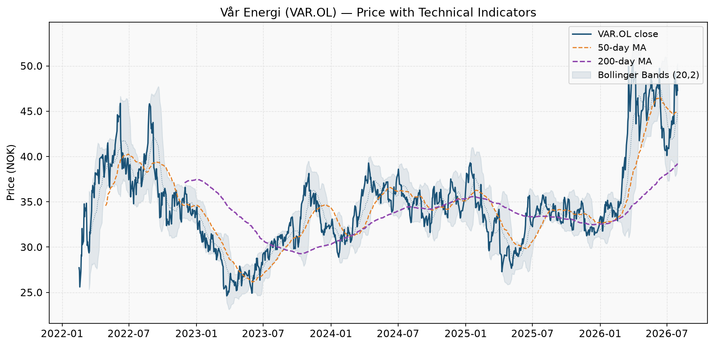
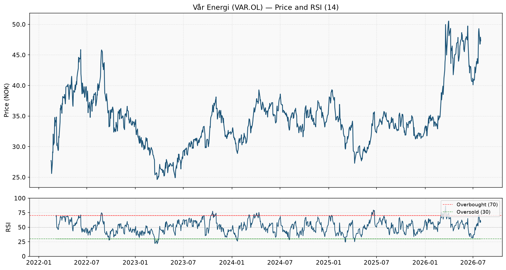
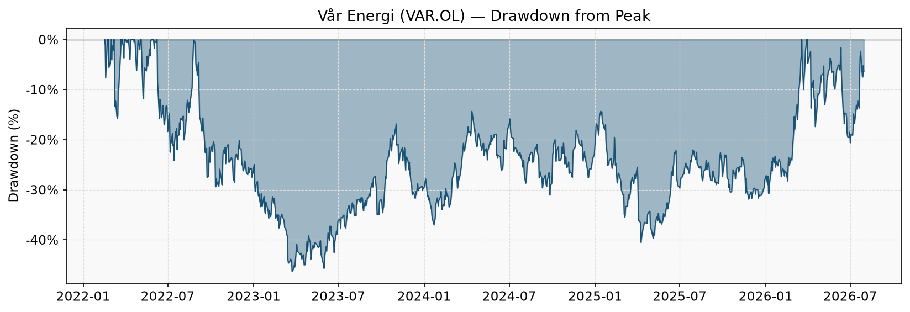
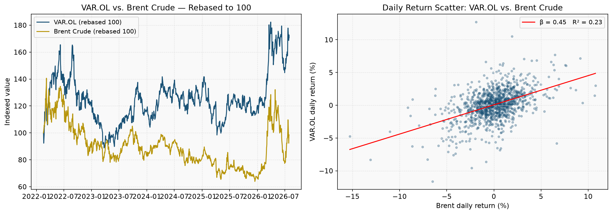
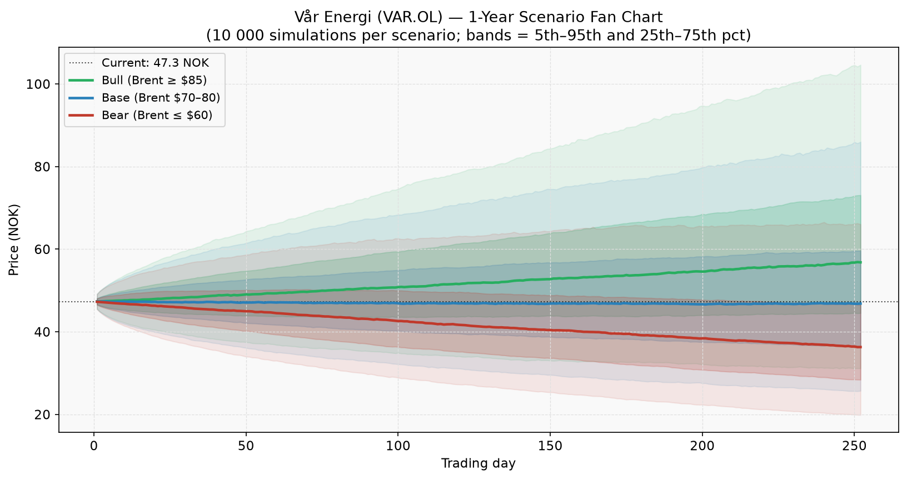
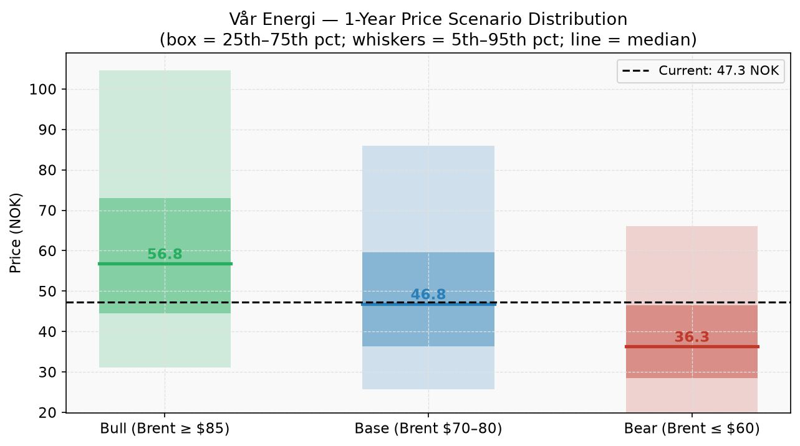

# Vår Energi (VAR.OL) — Stock Analysis & 1-Year Scenario Forecast

**Date:** July 30, 2026
**Data source:** LSEG Workspace API (`VAR.OL`, `LCOc1`, `.OSEBX`)
**Analysis period:** 2022-02-16 – 2026-07-30
**Script:** `scripts/analyze_var_energy.py`

---

## Executive Summary

Vår Energi (VAR.OL) is Norway's second-largest oil and gas producer on the Norwegian Continental Shelf (NCS), listed on Oslo Børs since February 2022. The stock is a **high-beta, leveraged play on Brent crude** with a committed 100% free-cash-flow dividend payout policy — making it one of the highest-yielding energy stocks in Europe when oil prices are constructive.

**Current price: 47.30 NOK**
The stock is currently **20.6% above** its 200-day moving average (39.22 NOK), and **6.4% below** its 52-week high of 50.54 NOK.

RSI is neutral (59). The preferred entry zone is 40.1–41.8 NOK (key support confluence). A stop below 36.6 NOK protects against a structural breakdown.

| Scenario | Oil Price | Median 1-Year Target | Total Return Est.* | P(Gain) |
|----------|-----------|---------------------|-------------------|---------|
| **Bull** | Brent ≥ $85 | **56.8 NOK** | +38% | 69% |
| **Base** | Brent $70–80 | **46.8 NOK** | +11% | 49% |
| **Bear** | Brent ≤ $60 | **36.3 NOK** | -18% | 24% |

*Total return includes estimated dividend yield per scenario. Actual dividends depend on realised oil prices, production, and management decisions.*

**Probability-weighted expected 1-year return: +11.9%**

---

## 1. Company Overview

| Attribute | Detail |
|-----------|--------|
| Exchange | Oslo Børs (Euronext Oslo) |
| Ticker | VAR.OL |
| IPO | 16 February 2022 |
| Major shareholder | Eni S.p.A (~69.6% pre-dilution) |
| Production | ~320 000–360 000 boepd (barrels of oil equivalent per day) |
| Key assets | Norwegian Continental Shelf (30+ fields) |
| Dividend policy | 100% of available cash flow from 2024 onwards |
| Sector | Energy — Exploration & Production (E&P) |

Vår Energi was formed from the 2018 merger of Eni Norge and Point Resources and listed in 2022 at approximately 29 NOK per share. The company operates long-life, low-decline assets across the NCS and has guided for production growth through new field developments (Balder X, Ringhorne North, Johan Castberg phase-in, and others).

The dividend commitment is the cornerstone of the investment thesis. At Brent crude in the $70–80 range, the implied annual dividend yield is typically **10–14%**, making VAR.OL among the highest-yielding liquid equity securities in the Norwegian market. This yield collapses sharply below $60/bbl and expands significantly above $85/bbl.

---

## 2. Price and Technical Analysis

### 2.1 Snapshot

| Indicator | Value | Signal |
|-----------|-------|--------|
| Current price | **47.30 NOK** | — |
| 50-day MA | 44.81 NOK | Price above 50-day MA ▲ |
| 200-day MA | 39.22 NOK | Above 200-day MA — long-term bullish ▲ |
| MA relationship | — | 50-day ABOVE 200-day (Golden Cross alignment ▲) |
| RSI (14-day) | 58.9 | Neutral |
| Bollinger upper | 50.25 NOK | — |
| Bollinger lower | 39.32 NOK | Within bands |
| 52-week high | 50.54 NOK | — |
| 52-week low | 31.25 NOK | — |
| vs. 52-week high | -6.4% | — |
| vs. 52-week low | +51.4% | — |

### 2.2 Moving Average Regime

The 50/200-day MA pair is a widely-followed trend regime filter. Currently the short-term MA is **above** the long-term MA — a **bullish** configuration. In VAR.OL's short listed history, MA crossovers have aligned closely with Brent crude trend changes:

- **50-day above 200-day**: Tends to coincide with Brent $75+, attracting income-seeking institutional buyers for the high dividend.
- **50-day below 200-day**: Often coincides with oil price weakness or uncertainty around dividend sustainability.

The current spread between 50-day (44.81 NOK) and 200-day (39.22 NOK) is **5.60 NOK (14.3%)**.

### 2.3 Relative Strength Index (RSI)

At **58.9**, the RSI is:
in neutral territory, providing no strong directional signal. Price action and support/resistance levels become the primary decision framework.

### 2.4 Drawdown

| Metric | Value |
|--------|-------|
| Maximum drawdown (since IPO) | **-46.3%** |
| Current drawdown from all-time high | **-6.4%** |
| Annualised volatility | 36.7% |
| Daily 95% VaR (historical) | -3.8% |

VAR.OL has experienced significant drawdowns since its 2022 IPO — unsurprising given the stock's high sensitivity to oil price fluctuations. The maximum drawdown of **-46.3%** reflects the magnitude of oil price corrections since listing. Investors must be prepared for these drawdowns to occur during any 12-month holding period.

---

## 3. Entry Point Analysis

### 3.1 Support and Resistance Map

Key price levels derived from historical support/resistance analysis:

| Price Level | Type | Significance |
|------------|------|-------------|
| 50.5 NOK | **Resistance** | Prior peak / key overhead supply |
| 49.7 NOK | **Resistance** | Secondary resistance from prior consolidation |
| **47.3 NOK** | *Current* | Current market price |
| 41.8 NOK | **Key Support** | Most-tested support since listing |
| 40.1 NOK | **Support** | Secondary support / base formation zone |
| 36.6 NOK | **Critical Support** | Break below signals structural weakness |

### 3.2 Entry Strategy

**Preferred entry zone: 40.1 – 41.8 NOK**

| Tranche | Price | Size | Rationale |
|---------|-------|------|-----------|
| First | 41.8 NOK (current) | 50% | Near key support; RSI 59 provides entry context |
| Second | 40.1 NOK | 50% | Adds on further weakness; stronger support level |
| Stop-loss | Below 36.6 NOK (close) | Exit all | Structural breakdown signal |

**Risk per share (stop to entry):** ~5.2 NOK
**Reward (base-case median):** ~5.1 NOK
**Risk/reward ratio (base case):** ~1.0:1

### 3.3 Key Catalysts (Next 12 Months)

| Catalyst | Direction | Expected Timeline |
|----------|-----------|-------------------|
| Quarterly production/earnings updates | Both | Q1–Q4 2025 |
| Brent crude trend | Both | Ongoing |
| Norges Bank interest rate decisions | Positive on cuts | 2025 |
| NCS license rounds (APA/numbered) | Positive | 2025 |
| Eni potential stake reduction | Negative (supply) | Uncertain |
| Energy transition regulation | Negative | Ongoing |
| New field ramp-ups (Balder X, Johan Castberg) | Positive | 2025–2026 |

---

## 4. Oil Price Correlation

### 4.1 Sensitivity Metrics

| Metric | Value | Interpretation |
|--------|-------|----------------|
| Oil beta (daily returns) | **0.45x** | Each 1% Brent move → VAR moves ~0.4% |
| R² (Brent vs. VAR.OL) | **22.5%** | Brent explains 23% of VAR daily variance |
| Rolling 90-day correlation | **0.54** | Current short-term relationship |

With a beta of **0.45x**, VAR.OL is moderately leveraged to Brent crude. This is consistent with a pure-play E&P company where every dollar of oil revenue flows directly to operating cash flow (relative to an integrated major that also has refining/chemicals as a partial buffer).

The high R² of **22.5%** means that oil price moves are the **dominant driver** of VAR.OL's stock performance. Macro views on oil must therefore come first in any investment thesis for this stock.

### 4.2 Dividend-Yield Sensitivity

VAR.OL's 100%-payout policy transforms the stock into a **leveraged oil-linked income instrument**:

| Brent Scenario | Est. Annual Dividend | Est. Yield at 47 NOK |
|---------------|---------------------|--------------------------|
| $95/bbl (upside) | ~10.41 NOK | ~22% |
| $85/bbl (bull) | ~8.51 NOK | ~18% |
| $75/bbl (base) | ~5.68 NOK | ~12% |
| $60/bbl (bear) | ~2.36 NOK | ~5% |
| $50/bbl (stress) | ~0.47 NOK | <2% (potential suspension) |

*Estimated from management's cash flow guidance and historical payout patterns. Production hedging and operating costs will cause actual dividends to differ.*

---

## 5. One-Year Scenario Analysis

### 5.1 Scenario Framework

Three scenarios are modelled, differentiated by the Brent crude price level which is the primary driver:

| Scenario | Brent Assumption | Annual Drift (stock) | Probability |
|----------|-----------------|----------------------|-------------|
| **Bull** | ≥ $85/bbl | +25% | ~25% |
| **Base** | $70–80/bbl | +5% | ~55% |
| **Bear** | ≤ $60/bbl | −20% | ~20% |

The simulation applies each scenario's drift to VAR.OL's historical daily volatility of **2.31%** (36.7% annualised), running **10 000 paths** per scenario over **252 trading days**.

### 5.2 Scenario Fan Chart

### 5.3 Outcome Distributions

### 5.4 Detailed Scenario Tables

#### Bull Case — Brent ≥ $85/bbl

| Metric | Value |
|--------|-------|
| Median 12-month target | **56.8 NOK** |
| 25th–75th pct range | 44.5 – 73.1 NOK |
| 5th–95th pct range | 31.2 – 104.6 NOK |
| Probability above current | **69%** |
| Price return (median) | +20% |
| Est. dividend yield | ~18% |
| **Total return estimate (median)** | **+38%** |

**Key assumptions:** OPEC+ maintains discipline; China demand continues recovering; no major NCS production outages; Norges Bank cuts rates 50–100 bps.

#### Base Case — Brent $70–80/bbl

| Metric | Value |
|--------|-------|
| Median 12-month target | **46.8 NOK** |
| 25th–75th pct range | 36.4 – 59.6 NOK |
| 5th–95th pct range | 25.7 – 86.0 NOK |
| Probability above current | **49%** |
| Price return (median) | +-1% |
| Est. dividend yield | ~12% |
| **Total return estimate (median)** | **+11%** |

**Key assumptions:** Moderate global demand growth; OPEC+ partially unwinds cuts; NCS production meets guidance; Norwegian macro environment stable.

#### Bear Case — Brent ≤ $60/bbl

| Metric | Value |
|--------|-------|
| Median 12-month target | **36.3 NOK** |
| 25th–75th pct range | 28.4 – 46.5 NOK |
| 5th–95th pct range | 19.9 – 66.0 NOK |
| Probability above current | **24%** |
| Price return (median) | -23% |
| Est. dividend yield | ~5% |
| **Total return estimate (median)** | **-18%** |

**Key assumptions:** Global recession or demand shock; OPEC+ fracture; significant US shale production growth; potential dividend cut or suspension by management.

---

## 6. Risk Factors

### Downside Risks

| Risk | Likelihood | Potential Impact on Stock |
|------|-----------|--------------------------|
| Brent crude falls below $60/bbl | Medium | High: −30% to −50%; dividend cut risk |
| Production shortfall or field outage | Low–Medium | Medium: −10% to −20% |
| Norwegian windfall/carbon tax increase | Low–Medium | Medium: −5% to −15% |
| Eni secondary offering / stake sale | Medium | Medium: −5% to −10% (supply overhang) |
| NOK strengthening sharply vs. USD | Low | Low–Medium: reduces earnings in NOK |
| Global recession + demand destruction | Low | Very High: potential oil price collapse |
| Dividend suspension | Low (at Brent >$65) | Very High: yield investors exit |

### Upside Risks

| Risk | Likelihood | Potential Impact on Stock |
|------|-----------|--------------------------|
| Geopolitical disruption → oil spike | Low–Medium | Very High: stock +30% to +50% |
| Faster-than-expected OPEC+ cuts | Medium | High: Brent reprices to $90+ |
| Norges Bank rate cuts accelerate | Medium | Medium: multiple expansion |
| Accretive NCS acquisition | Low | Medium: growth re-rating |
| MSCI/FTSE index weight increase | Low | Low–Medium: passive buying |

---

## 7. Investment Summary

### Positioning

VAR.OL is appropriate for investors who:
1. Hold a **constructive view on oil ($70+)** over a 12-month horizon
2. Seek **high income** (10–18% dividend yield depending on oil) from a liquid, investment-grade issuer
3. Can tolerate **high volatility** (37% annualised) and drawdowns of up to 40–50%
4. Want **pure-play NCS exposure** without the refining/chemicals complexity of Equinor

### One-Page Summary

| | |
|---|---|
| **Current price** | 47.30 NOK |
| **Entry zone** | 40.1 – 41.8 NOK |
| **Stop-loss** | Below 36.6 NOK |
| **Bull target (12M)** | 57 NOK |
| **Base target (12M)** | 47 NOK |
| **Bear target (12M)** | 36 NOK |
| **Prob-weighted return** | +11.9% (incl. dividend) |
| **Overall stance** | **HOLD — wait for better entry** |

### Key Variable to Monitor

> **Brent crude price is the single most important variable for VAR.OL.** Set a Brent price alert at $65 (bear trigger) and $85 (bull trigger). All other analysis is secondary to oil price direction.

---

*Analysis generated: July 30, 2026. Data: LSEG Workspace API. Charts: `analysis/var_figures/`. Prices in NOK; oil in USD/bbl. This analysis is for informational purposes only and does not constitute investment advice.*
